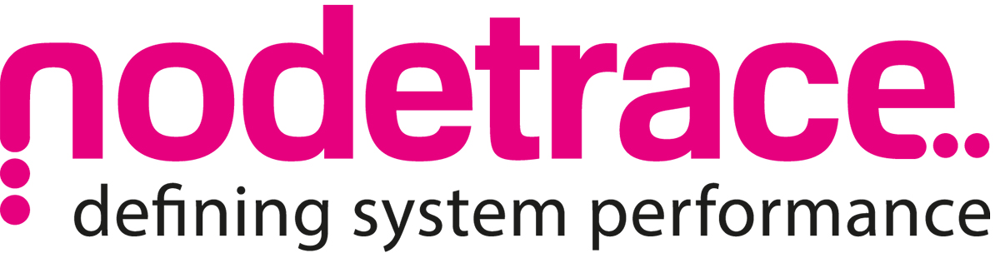

# Welcome

## Getting Super Powers with Nodetrace

Getting signed up for Nodetrace is super simple, we even make sure you have contact with a member of the team when you switch on for the first time. The [quick start](quick-start-guide.md) will get you going in a matter of minutes. 

#### What do I get with Nodetrace?

* Live Metrics
* Performance Counters
* All calls to Global::error \(with stacktrace\)
* All invocations of Form::run
* Custom events and custom exception logging APIs
* \[Experimental\] Client-side navigation events when pages are navigated by users

Once you are up and running spend some time in these documents finding out more about managing your systems:

### What do I need?

Nodetrace is built for Microsoft Dynamics 365 for Finance and Supply Chain Management. It allows performance data and logging to be sent to Azure Application Insights. You need very little to get going:

* D365 F&SCM Development environment 
* Azure Application Insights Resource
* Nodetrace deployable package
* Nodetrace subscription \(comes with a 14 day free trial\)


 We know you will love Nodetrace, so each subscription comes with a 14 day free trial


